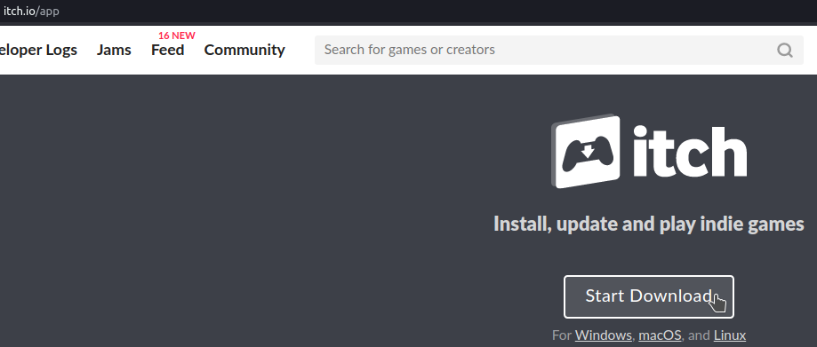
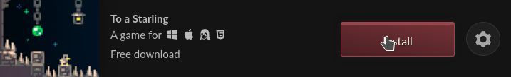
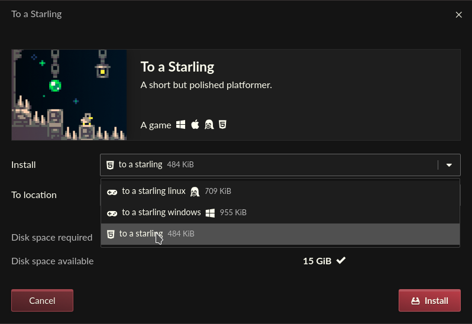
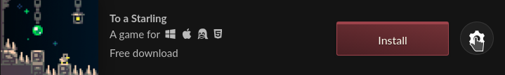
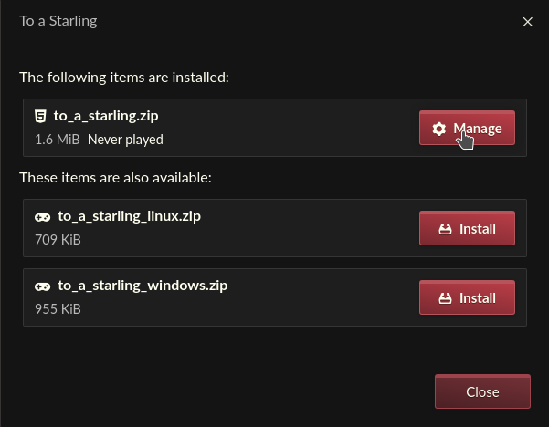
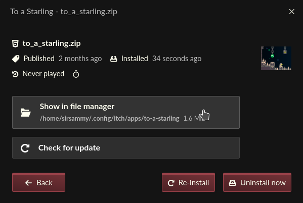

[itch.io](https://itch.io) is a game distribution platform with many indie games, including browser games.

All Itch browser games (Assuming the games don't have copy protection or use blocked resources) can be downloaded using [the Itch app](https://itch.io/app) except for games that have both a free browser version and a paid version, such as Big Tower Tiny Square. Instructions are below.

Go to [itch.io/app](https://itch.io/app) and download it.

Run itch-setup, launch itch, signup/login and then search for the game you want to unblock. Then press install.

Make sure you're installing the HTML version which should look like a 5.

Press the manage button.

Press manage.

Press show in file manager.

You're done! Now you can host the files.
